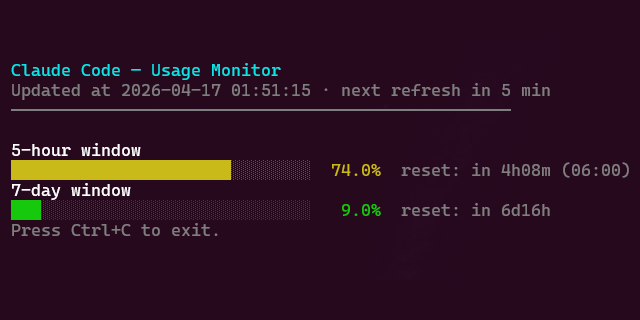

# claude-usage-dashboard

Real-time Claude Code usage monitor for the terminal (Pro/Max plans).

## Prerequisites

- Python 3.11+
- Claude Code installed and authenticated (`~/.claude/.credentials.json` must exist)

## Installation

No external dependencies. Clone the repository and run directly:

```bash
git clone https://github.com/wcruz-br/claude-usage-dashboard.git
cd claude-usage-dashboard
```

## Usage

```bash
python claude_usage.py
```

The dashboard refreshes automatically every 5 minutes. Press `Ctrl+C` to exit.

### Example output



Bars change color based on utilization: green (< 60%), yellow (60–84%), red (≥ 85%).

## Configuration

No environment variables. The only tunable constants are in the script itself:

| Constant | Default | Description |
|---|---|---|
| `REFRESH_INTERVAL_SECONDS` | `300` | Refresh interval (seconds) |
| `BAR_WIDTH` | `30` | Progress bar width (characters) |

## Contributing

### Linting

The project uses [ruff](https://docs.astral.sh/ruff/) for linting and formatting. `ruff.toml` contains project-specific rules.

```bash
ruff check --fix claude_usage.py
ruff format claude_usage.py
```

### API endpoint

The script queries `GET https://api.anthropic.com/api/oauth/usage` with the header `anthropic-beta: oauth-2025-04-20`. Response shape:

```json
{
  "five_hour": { "utilization": 4.0, "resets_at": "2026-04-16T17:45:00Z" },
  "seven_day":  { "utilization": 31.0, "resets_at": "2026-04-20T09:00:00Z" }
}
```

`utilization` is a raw percentage (e.g. `4.0` = 4%). Either field can be `null`. This endpoint is undocumented and may change without notice. If the script breaks, check whether `~/.claude/.credentials.json` changed format or the endpoint was updated. Alternative: [ccusage](https://github.com/ryoppippi/ccusage).

### Submitting changes

1. Fork the repository
2. Create a feature branch (`git checkout -b feature/your-feature`)
3. Commit your changes following [Conventional Commits](https://www.conventionalcommits.org/)
4. Open a pull request describing what changed and why

## Author

**[Willian Cruz](https://github.com/wcruz-br)** · [LinkedIn](https://linkedin.com/in/wcruz) · [wcruz.br@gmail.com](mailto:wcruz.br@gmail.com)

## Contributors

Thanks to everyone who has contributed to this project:

- [Tiago Miranda](https://github.com/mirandaftiago) — User-Agent honesty refactor, ANSI clear screen, HTTP error body logging, cross-platform credential resolution

## License

This project is licensed under [Creative Commons Attribution 4.0 International (CC BY 4.0)](https://creativecommons.org/licenses/by/4.0/).

You are free to share and adapt the material for any purpose, provided appropriate credit is given.
